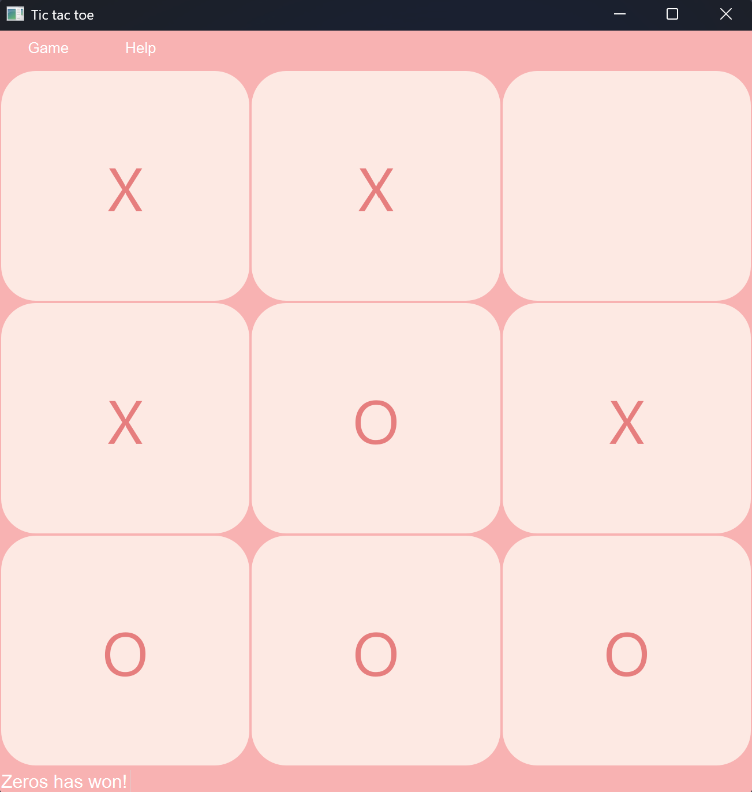

# Tic tac toe
Normal tic tac toe game with 2 mods: with yourself and with a bot. Made with 

### Main window

## Tech stack
* Language: Python 3.13
* Framework: PyQt6

## Credits
*Victory sound effect*: Sound Effect by <a href="https://pixabay.com/users/eaglaxle-53749042/?utm_source=link-attribution&utm_medium=referral&utm_campaign=music&utm_content=464016">EAGLAXLE</a> from <a href="https://pixabay.com/sound-effects//?utm_source=link-attribution&utm_medium=referral&utm_campaign=music&utm_content=464016">Pixabay</a>
*Mouse click sound effect*: Sound Effect by <a href="https://pixabay.com/users/universfield-28281460/?utm_source=link-attribution&utm_medium=referral&utm_campaign=music&utm_content=383961">Universfield</a> from <a href="https://pixabay.com/sound-effects//?utm_source=link-attribution&utm_medium=referral&utm_campaign=music&utm_content=383961">Pixabay</a>

